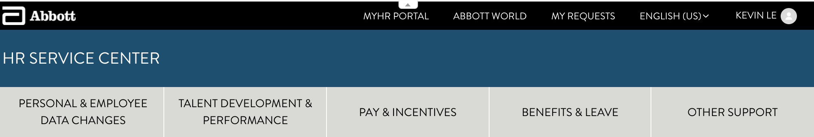
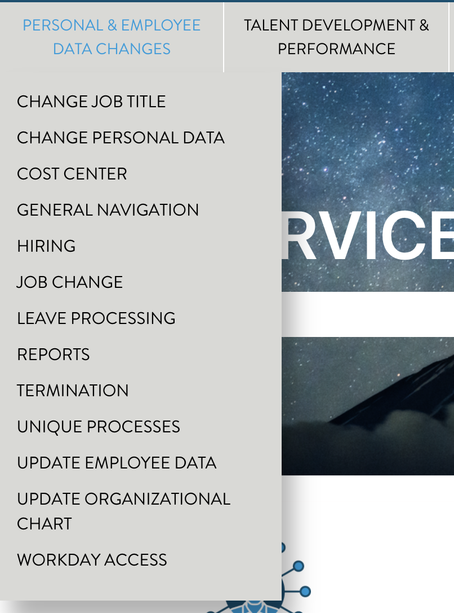
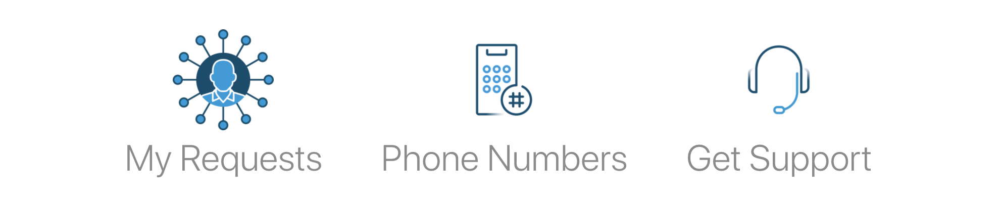
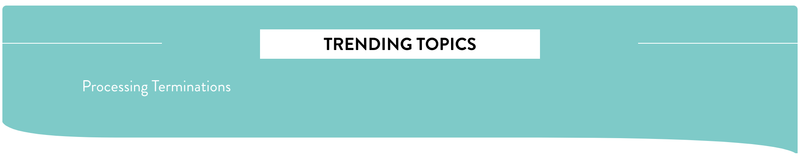
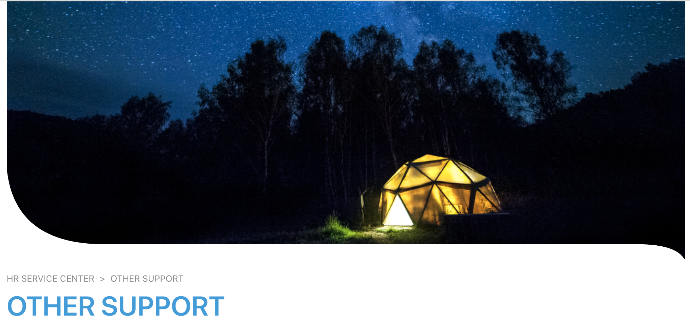
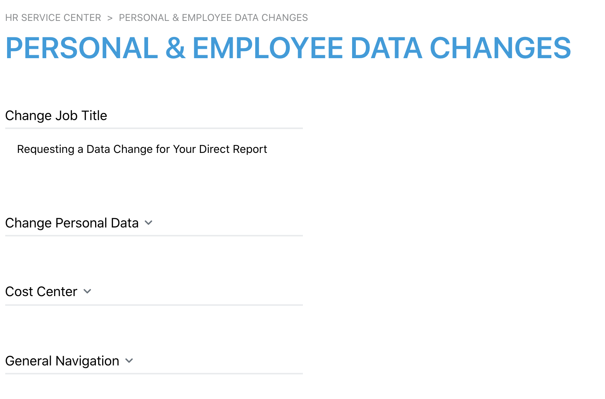

# Abbott Guide

## Table of Contents

- Custom Functionalities
- Useful Links
- Project Team
- Support

## Custom Functionalities

### Home Page

Template name: home_page.hbs

<b>Page Customizations</b>

1. Navigation Header

- Display the header in three tiers, containing links to internal and external resources.
- Some specific categories are limited by region.

2. Subheader

- Display the sections for each corresponding category in a dropdown menu upon hover.

  

3. Easy Access Tiles

- Able to access My Requests, a Phone Numbers article, and to quickly open the Chat Widget.

  

4. Trending Topics

- Displays Promoted Articles using the Handlebars helper, limited to 4.

  

5. Knowledge Center Tiles

- Generated from the Knowledge Center with descriptions.
- Icons are linked by Category ID e.g. category-360006111172 

  

### Category Page

Template name: category_page.hbs

<b>Page Customizations</b>

1. Banner Images per Category

- Images are linked by Category ID e.g. hero-360006131271

   

2. Displays Breadcrumbs

3. Displays Sections in accordian fashion with Promoted Articles and 5-6 Articles with the ability to see more.

    

### Section Page

Template name: section_page.hbs

<b>Page Customizations</b>

1. Banner Image tied to associated Category

### Article Page

Template name: article_page.hbs

<b>Page Customizations</b>

1. Banner Image tied to associated Category

2. Disable comments and Follow functionality

3. Custom lists for Recent Articles and Related Articles on the side.

   

### Theme Settings

1. Icons

- Easy Access Tiles' icons are easily configured.

2. Homepage Phone Numbers Tile

- The ID of the article that contains the Phone Numbers.

## Customization Instructions

### Local with ZAT

- Run this command `zat theme preview` in the root directory of the Help Center and input all the necessary information. See more about [Previewing theme changes locally here](https://support.zendesk.com/Guide/en-us/articles/115012793547)

### Production

- Create a zip file of this Guide
- Upload the zip file on `Zendesk Guide > Guide Admin > Themes (eye icon in the sidebar menu) > Add Theme > Import Theme`

## Useful Links

- [Invision Prototype](https://zendesk.invisionapp.com/share/5H10SDK0VPYZ#/screens/450732563)
- [Zendesk Guide Documentation](https://developer.zendesk.com/documentation/help_center/help-center-templates/introduction/)

## Project Team

- Skip Moore (Sr. Development Services Manager)
- Carlos Escamilla (Technical Architect)
- Kelsey Bonney (Engagement Manager)
- Kevin Le (Web Developer)

## Support

Please submit bug reports to support@zendesk.com
